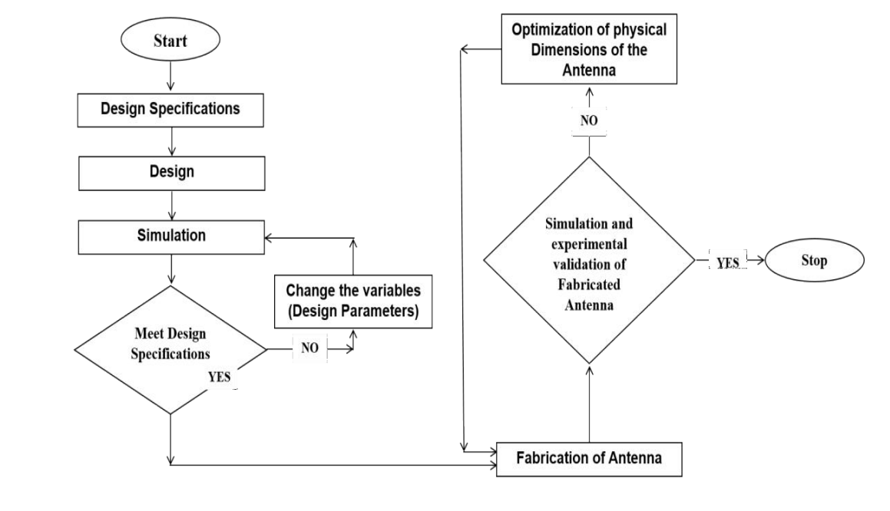
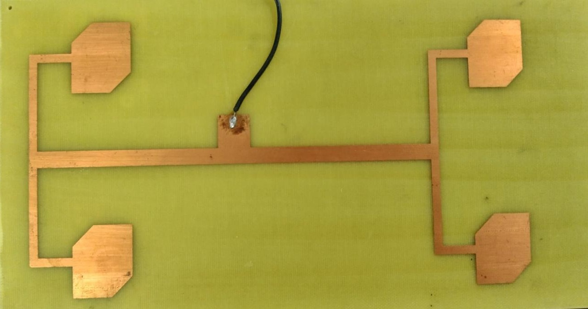
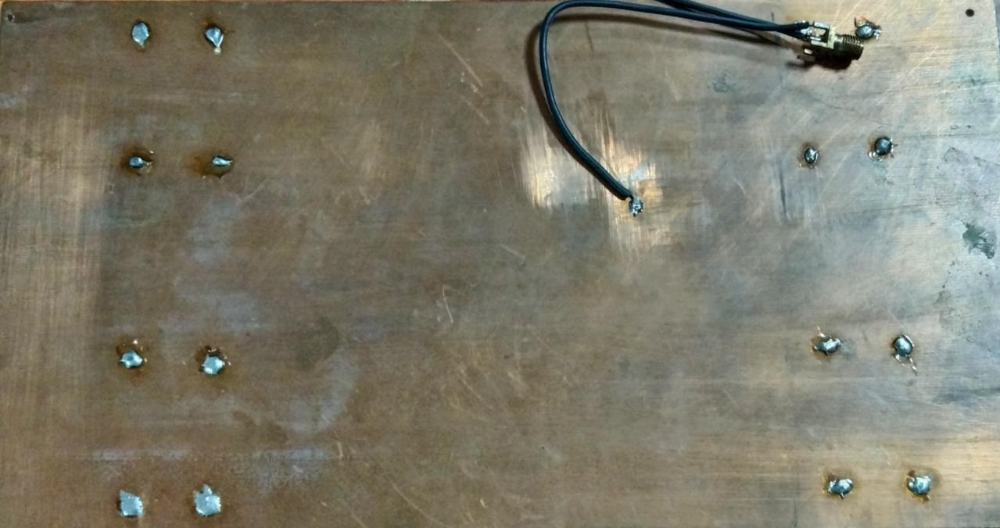
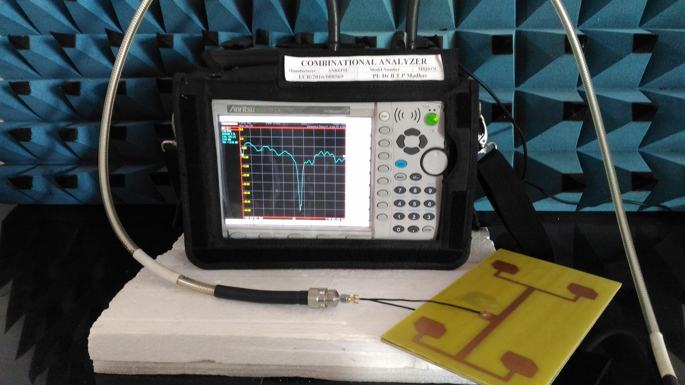

# Circularly Polarized Patch Antenna Array Using EBG

A **2×2 circularly polarized microstrip patch antenna array** designed and experimentally validated at the **2.4 GHz ISM band**, incorporating a **Mushroom-type Electromagnetic Band Gap (EBG) structure** as a high-impedance surface to investigate surface-wave suppression and improvement in antenna performance.

---

## 📌 Overview

This project presents the **design, electromagnetic simulation, fabrication, and experimental characterization** of a 2×2 circularly polarized patch antenna array operating at **2.4 GHz**.

The antenna was designed and analyzed using **ANSYS HFSS**, fabricated using a photolithographic process, and experimentally characterized using a **Vector Network Analyzer (VNA)**.

A Mushroom-type **Electromagnetic Band Gap (EBG)** structure was incorporated as a high-impedance surface to reduce surface-wave propagation and investigate its influence on radiation efficiency, impedance matching, gain, and overall antenna performance.

The project follows a complete hardware-oriented research workflow:

**Electromagnetic Design → Simulation → Optimization → Fabrication → Measurement → Experimental Validation**

---

## 🧠 Motivation & Research Context

Microstrip patch antennas are widely used in compact wireless communication systems because of their low profile, ease of fabrication, and compatibility with planar circuits. However, conventional microstrip antennas can be affected by **narrow bandwidth, surface-wave propagation, radiation losses, and undesired back radiation**.

This project investigates the use of an **Electromagnetic Band Gap (EBG) structure** to address these limitations.

The EBG structure acts as a high-impedance surface and is investigated for its ability to:

* Suppress surface-wave propagation
* Reduce unwanted back-lobe radiation
* Improve radiation efficiency
* Enhance antenna gain
* Maintain suitable impedance matching
* Improve the overall electromagnetic performance of the antenna

The design operates in the **2.4 GHz ISM band**, making the study relevant to compact wireless and IoT-oriented communication systems.

---

## 🎯 Project Objectives

The primary objectives of this work were to:

1. Design a **2×2 circularly polarized patch antenna array** operating near 2.4 GHz.
2. Integrate a **Mushroom-type EBG structure** as a high-impedance surface.
3. Analyze the electromagnetic behavior of the proposed configuration using HFSS.
4. Fabricate the optimized antenna structure using a photolithographic process.
5. Characterize the fabricated antenna experimentally using a Vector Network Analyzer.
6. Compare simulated and measured performance parameters.
7. Investigate the effect of the EBG structure on radiation efficiency and antenna performance.

---

## 🛠️ Technologies, Tools & Experimental Setup

### Electromagnetic Simulation

* **ANSYS HFSS (High Frequency Structure Simulator)**

### Antenna Design

* 2×2 Microstrip Patch Antenna Array
* Circular Polarization using truncated patch edges
* Inset / microstrip line feeding
* Mushroom-type EBG structure
* High-impedance surface

### Substrate

* **FR-4**
* Relative dielectric constant: **4.4**
* Thickness: **1.6 mm**

### Fabrication

* Photolithography / photo-etching process

### Experimental Characterization

* **Vector Network Analyzer (VNA)**

---

## 🔬 Design & Methodology

The project was developed through a systematic simulation-to-experiment workflow.

### 1. Antenna Design

A microstrip patch antenna was designed for operation around the **2.4 GHz ISM band**. A 2×2 array configuration was developed to improve the radiation characteristics compared with an individual patch.

### 2. Circular Polarization

Circular polarization was achieved through the use of **truncated patch edges**, enabling the generation of orthogonal field components with the required phase relationship.

### 3. EBG Integration

A Mushroom-type EBG structure was incorporated as a high-impedance surface.

The structure was investigated to reduce surface-wave propagation and improve the radiation behavior of the antenna array.

### 4. Electromagnetic Simulation

The complete structure was modeled and simulated in **ANSYS HFSS**.

Key performance parameters were evaluated, including:

* Return loss
* VSWR
* Resonant frequency
* Gain
* Radiation efficiency
* Axial ratio
* EBG reflection-phase bandwidth

### 5. Fabrication

After simulation and optimization, the antenna structure was fabricated using a photolithographic/photo-etching process on an FR-4 substrate.

### 6. Experimental Validation

The fabricated antenna was experimentally characterized using a **Vector Network Analyzer (VNA)**.

The measured results were compared with the simulated results to evaluate the agreement between electromagnetic modeling and physical implementation.

---

# 📊 Results & Experimental Validation

The final design demonstrated strong agreement between simulation and experimental measurements.

| Parameter          | Simulated | Measured |
| ------------------ | --------: | -------: |
| Resonant Frequency |   2.4 GHz |  2.4 GHz |
| Return Loss        | −37.42 dB | −39.9 dB |
| VSWR               |      1.02 |     1.03 |
| Gain               |   7.49 dB |  8.02 dB |

### Additional Results

* **Bandwidth:** 180 MHz
* **EBG Reflection Phase Bandwidth:** 390 MHz
* **Radiation Efficiency:** Improved from approximately **38% to 61%** with EBG integration.
* **Simulation–Measurement Correlation:** Experimental measurements showed close agreement with the simulated response.

The close correspondence between simulated and measured return loss and VSWR demonstrates that the fabricated antenna closely followed the intended electromagnetic design.

---

## 📈 Key Findings

The study demonstrated that integrating an EBG structure into the antenna configuration can contribute to improved radiation characteristics.

### Major observations

**✔ Surface-wave suppression**

The EBG structure was used to suppress surface-wave propagation associated with the conventional patch configuration.

**✔ Improved radiation efficiency**

Radiation efficiency increased from approximately **38% to 61%** with EBG integration.

**✔ Improved gain**

The simulated gain was **7.49 dB**, while the measured gain reached **8.02 dB**.

**✔ Strong impedance matching**

The measured return loss reached approximately **−39.9 dB**, with a measured VSWR of approximately **1.03**.

**✔ Experimental validation**

The fabricated antenna measurements demonstrated close agreement with the simulated electromagnetic response.

---

# 🖼️ Simulation Results

## 📐 Design Methodology

**Figure 1 — Design methodology and project workflow**



---

## 🛰️ HFSS Antenna Model

**Figure 2 — 3D simulation model of the 2×2 antenna array in ANSYS HFSS**


---

## 📉 Simulated Return Loss

**Figure 3 — Simulated S11 / return-loss response**


---

## 📊 Simulated VSWR

**Figure 4 — Simulated VSWR response**


---

## 🔄 Axial Ratio

**Figure 5 — Simulated axial-ratio response for circular polarization**


---

# 🏭 Fabrication & Experimental Characterization

The optimized antenna was fabricated on an FR-4 substrate using a photolithographic/photo-etching process.

The fabricated prototype was subsequently characterized using a Vector Network Analyzer to evaluate its impedance characteristics and compare experimental measurements with the HFSS simulation results.

---

## 🔧 Fabricated Antenna — Front View

**Figure 6 — Fabricated antenna prototype, front view**



---

## 🔧 Fabricated Antenna — Back View

**Figure 7 — Fabricated antenna prototype, back view**



---

## 📡 VNA Measurement — Return Loss

**Figure 8 — Measured return-loss response using a Vector Network Analyzer**


---

## 📡 Detailed Antenna Measurement

**Figure 9 — Detailed measured antenna return-loss response**



---

## 📈 Smith Chart

**Figure 10 — Measured impedance response represented using a Smith chart**


---

## 📊 Measured VSWR

**Figure 11 — Experimentally measured VSWR**


---

# 💡 Design Justifications

## Why a 2×2 Array?

A 2×2 array configuration was selected to obtain improved radiation characteristics compared with a single patch while maintaining a practical planar structure.

The resulting design achieved a simulated gain of **7.49 dB** and a measured gain of **8.02 dB**.

## Why EBG?

The EBG structure was incorporated to investigate the suppression of surface-wave propagation and its effect on antenna radiation characteristics.

The results showed an improvement in radiation efficiency from approximately **38% to 61%** with EBG integration.

## Why FR-4?

FR-4 was selected because of its:

* Low cost
* Wide availability
* Ease of fabrication
* Practical suitability for prototype development

Although FR-4 is not necessarily the highest-performance substrate for RF applications, its accessibility makes it useful for experimental prototyping and validation.

## Why Experimental Validation?

A central aspect of the project was establishing a relationship between **electromagnetic simulation and physical measurement**.

The fabricated prototype was tested using a VNA, allowing the simulated and measured responses to be compared rather than relying solely on simulation.

---

# 🧪 Simulation-to-Experiment Workflow

One of the key aspects of this project was following the complete engineering workflow from computational modeling to physical validation:

```text
Problem Definition
       ↓
Antenna Design
       ↓
EBG Integration
       ↓
HFSS Electromagnetic Simulation
       ↓
Performance Analysis & Optimization
       ↓
Prototype Fabrication
       ↓
VNA Characterization
       ↓
Simulation vs. Measurement Comparison
       ↓
Performance Evaluation
```

This workflow provided practical experience in connecting **electromagnetic modeling, hardware fabrication, and experimental characterization**.

---

# 🎓 Research & PhD Relevance

This project strengthened my foundation in research-oriented hardware development, particularly across:

* Electromagnetic simulation
* RF and microwave systems
* Antenna design
* High-impedance surfaces
* EBG structures
* Hardware prototyping
* Experimental characterization
* Simulation-to-measurement validation

The experience also developed a broader understanding of how physical communication hardware can be designed, evaluated, and optimized through an iterative combination of **simulation, implementation, measurement, and analysis**.

These foundations complement my broader interests in **Embedded Systems, IoT, intelligent edge devices, and communication-oriented systems**, where efficient RF interfaces and reliable wireless connectivity are important components of practical system design.

---

# 📁 Repository Structure

```text
circularly-polarized-patch-antenna-using-ebg/
│
├── FabricatedImages/
│   ├── FabricatedAntenna_Frontview.png
│   ├── FabricatedAntenna_Backview.png
│   ├── VNA_ReturnLoss.png
│   ├── VNA_Antenna_ReturnLoss.png
│   ├── VNA_SmithChart.png
│   └── VNA_VSWR.png
│
├── SimulatedImages/
│   ├── FlowChart.png
│   ├── Simulated_Antenna.png
│   ├── Return_Loss.png
│   ├── VSWR.png
│   └── Axial_Ratio_Plot.png
│
├── ProjectReport.pdf
└── README.md
```

---

# 🔭 Future Research Directions

Potential extensions of this work include:

* Further optimization of EBG geometries and antenna parameters
* Investigation of alternative substrate materials
* Integration with compact wireless and IoT platforms
* Investigation of antenna performance under different operating environments
* Co-design of RF interfaces with embedded and edge-computing systems
* Exploration of intelligent optimization techniques for antenna design

---

# 👩‍💻 Author

**Khatija Mahveen**

**B.E. Electronics & Communication Engineering**
**M.E. Embedded Systems**

### Research Interests

**Embedded Systems · Edge AI · IoT · Real-Time Systems · Communication Systems · Hardware–Software Co-Design · RF & Microwave Systems**

---

## 📜 License

This repository is intended for **academic and research portfolio purposes**.

The project materials are shared for educational and research reference. Please acknowledge the author when reusing substantial portions of the work.

---

## ⭐ Project Summary

This work demonstrates an end-to-end engineering approach to developing a **2×2 circularly polarized patch antenna array with EBG integration**, progressing from electromagnetic simulation and optimization to physical fabrication and VNA-based experimental validation.

The project combines **RF/microwave engineering, electromagnetic simulation, hardware prototyping, and experimental analysis** into a single research-oriented study.
