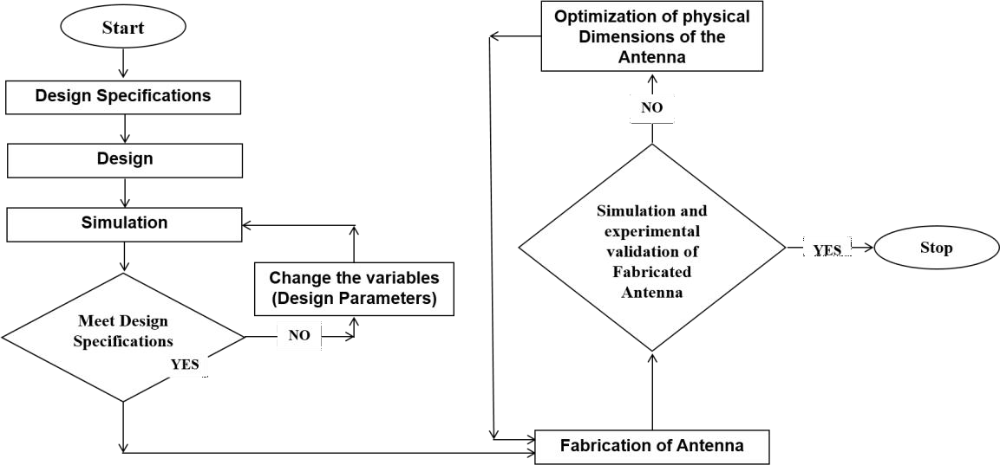
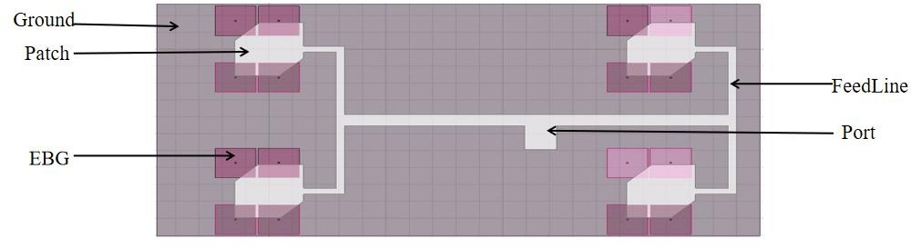
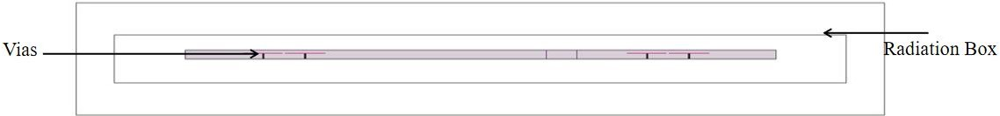
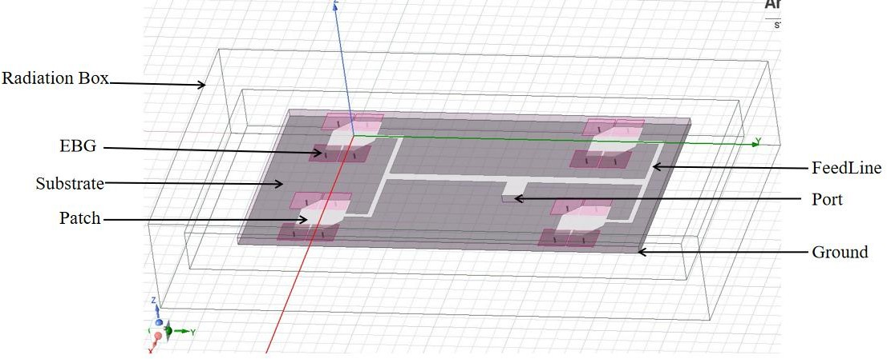
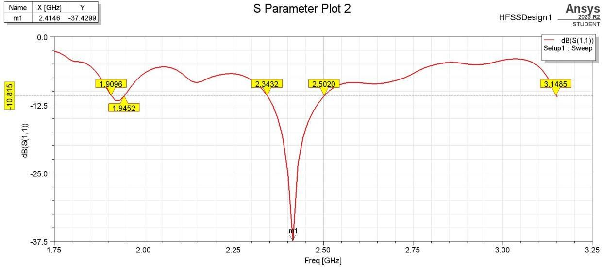
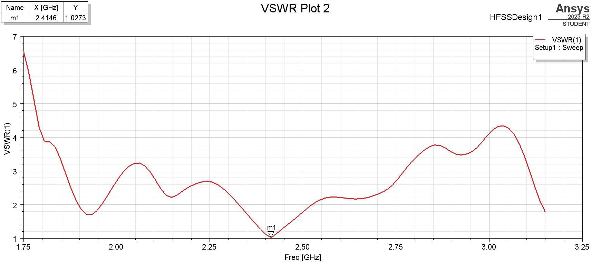
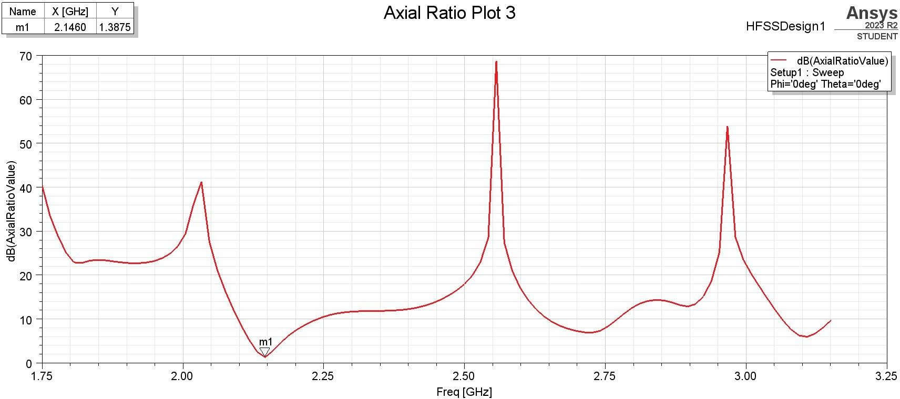
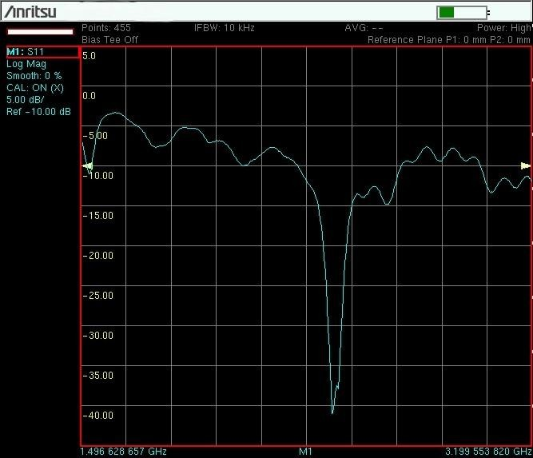
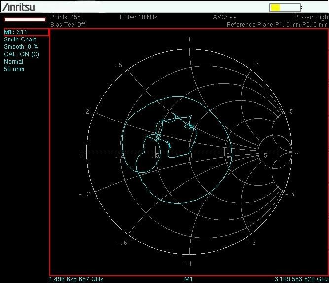
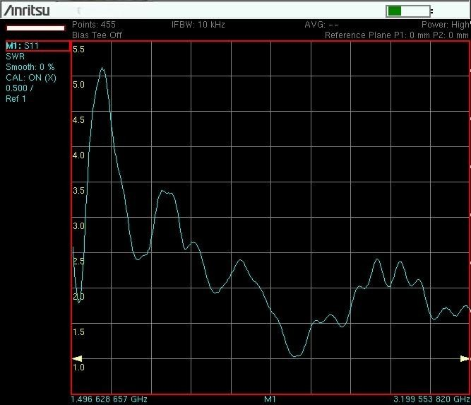

# Circularly Polarized Patch Antenna Array using High Impedance Surface (EBG)

## 📌 Overview
This project focuses on the design, simulation, fabrication, and characterization of a 2x2 Circularly Polarized Patch Antenna Array operating at the 2.4 GHz ISM band. To overcome the inherent limitations of microstrip patch antennas (such as narrow bandwidth and surface wave losses), a Mushroom-type Electromagnetic Band Gap (EBG) structure is integrated as a high-impedance ground plane.

## 🧠 Motivation & Research Context
Microstrip patch antennas are essential for modern wireless communication, but they suffer from low gain, narrow bandwidth, and surface wave propagation issues. This project addresses these challenges by implementing an EBG structure to suppress surface waves, reduce back lobe radiation, and enhance overall antenna efficiency, making it suitable for Wi-Fi, Bluetooth, and satellite communication applications.

## 🛠️ Technologies & Tools Used
- **Simulation Tool:** ANSYS HFSS (High Frequency Structure Simulator)
- **Substrate:** FR-4 (Dielectric constant: 4.4, Thickness: 1.6 mm)
- **Fabrication:** Photolithography (Photo-etching process)
- **Testing:** Vector Network Analyzer (VNA)
- **Feeding Technique:** Inset / Microstrip Line Feed
- **Polarization Technique:** Truncated Edges (Circular Polarization)

## 📊 Results & Validation
- **Resonant Frequency:** 2.4 GHz
- **Return Loss (Simulated):** -37.42 dB
- **Return Loss (Measured):** -39.9 dB
- **VSWR:** 1.02 (Simulated) | 1.03 (Measured)
- **Gain:** 7.49 dB (Simulated) | 8.02 dB (Measured)
- **Bandwidth:** 180 MHz
- **EBG Reflection Phase Bandwidth:** 390 MHz
- **Radiation Efficiency:** Improved from 38% to 61% with EBG
- **Correlation:** High correlation achieved between simulated and measured results.

## 🖼️ Project Images

### 📊 Simulated Results (HFSS)

    
    
<em>Figure 1: Flowchart showing design methodology</em>

    
    
    
<em>Figure 2: Proposed Antenna Array (Top View)</em>

    
    
    
<em>Figure 3: Proposed Antenna Array (Side View)</em>

    
    
    
<em>Figure 4: 3D Simulation of the Antenna Array in HFSS</em>

    
    
    
<em>Figure 5: Simulated Return Loss Plot</em>

    
    
    
<em>Figure 6: Simulated VSWR Plot</em>

    
    
    
<em>Figure 7: Axial Ratio Plot</em>

### 🏭 Fabricated Hardware & Testing

    
    
<em>Figure 8: Measured Return Loss on VNA</em>

    
    
    
<em>Figure 9: Detailed VNA Return Loss Result</em>

    
    
    
<em>Figure 10: Measured Smith Chart</em>

    
    
    
<em>Figure 11: Measured VSWR</em>

## 🧑‍💻 Author
**Khatija Mahveen**
- B.E. Electronics & Communication Engineering
- M.E. Embedded Systems & IoT | PhD Aspirant
- Focus: RF & Microwave Engineering, Embedded Systems

## 📜 License
This project is licensed for academic and research purposes.
